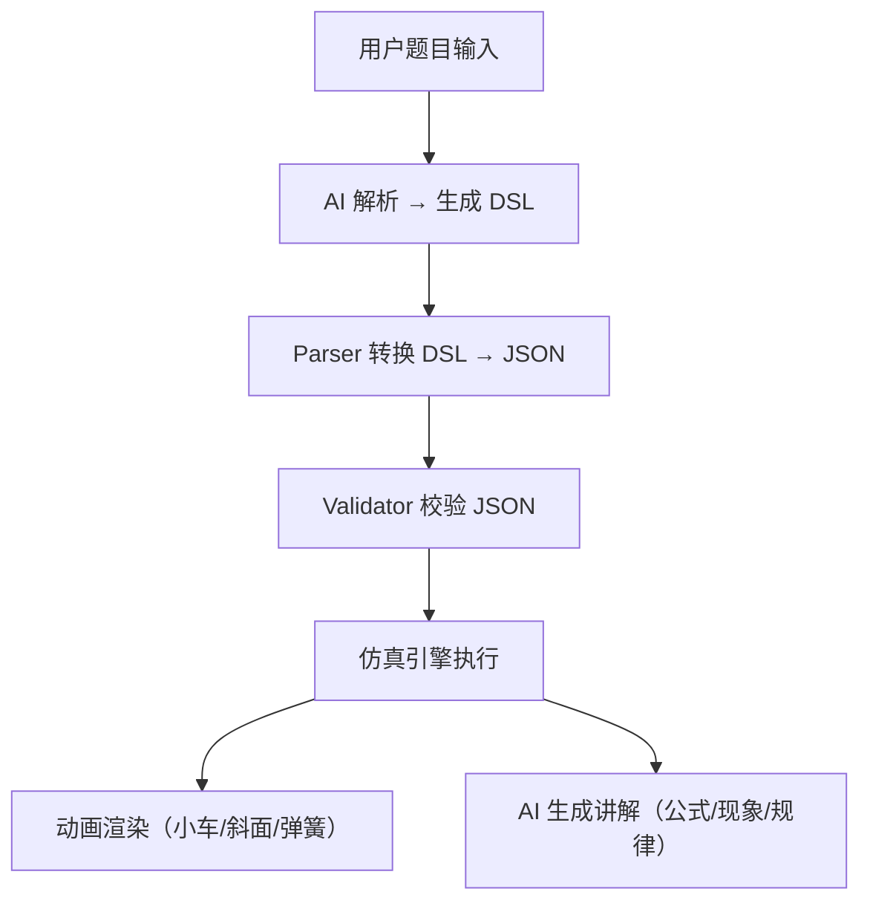

# 📘 标准文档模版：AI 题目解析 → DSL → JSON → 仿真引擎 → 动画 + 讲解

## 流程总览（Mermaid 流程图）

```mermaid
flowchart TD
    A[用户题目输入] --> B[AI 解析 → 生成 DSL]
    B --> C[Parser 转换 DSL → JSON]
    C --> D[Validator 校验 JSON]
    D --> E[仿真引擎执行]
    E --> F1[动画渲染（小车/斜面/弹簧）]
    E --> F2[AI 生成讲解（公式/现象/规律）]
```
